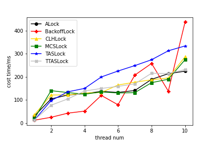

# ucas_concurrent_hw6
> 问题说明
> 1. 参考PPT第93页所示截图及引用文献（见附件），对本讲的并发锁对象进行性能分析和对比。实验设计，可参考上述文献及：http://igoro.com/archive/gallery-of-processor-cache-effects/
> PPT第63页给出参考设计：
> 1) 并发对象：计数器（counter），初始值为0
> 
> 2) 并发任务：n线程互斥访问并发计数器，总共访问1百万次临界区：counter = counter 
> 这样，总的计算量是固定的（1百万次操作，须确保计数器的最终值是1百万）。
> 图形展示随线程数量的变化，这1百万次操作所需花费时间的变化。
> 2. 尝试用上一讲的universal construction实现并发锁（可参考上一讲PPT第163页），并通过上一题的实验对比分析其性能。

## Q1
结果如下表和图片所示, 表格单位为ms, 每种并发锁执行5次去平均时间.

||1|2|3|4|5|6|7|8|9|10|
|---|---|---|---|---|---|---|---|---|---|---|
|ALock|30.0| 104.6| 121.6| 127.6| 137.2| 132.8| 141.0| 189.4| 214.0| 224.8|
|BackoffLock|12.4| 25.0| 43.0| 51.8| 119.8| 79.2| 207.8| 258.4| 138.4| 437.6|
|CLHLock|35.4| 121.6| 121.8| 130.2| 132.4| 165.0| 177.2| 187.6| 195.6| 287.2|
|MCSLock|18.6| 140.4| 132.2| 125.0| 134.8| 130.4| 132.0| 175.0| 190.0| 274.6|
|TASLock|12.8| 97.2| 135.4| 150.2| 199.8| 225.6| 249.0| 274.4| 313.2| 334.2|
|TTASLock|13.2| 77.4| 104.6| 138.8| 150.0| 159.0| 170.0| 216.0| 214.8| 231.8|

## Q2
Universal Construction执行1000000非常慢, 因为竞争失败的线程会把胜利者的结点重复加入日志, 虽然不影响计算结果,但是对日志中的方法调用依次重放的时间开销很高. 以下为计数器累加到1000测得的平均耗时, 单位为ms.
||1|2|3|4|5|6|7|8|9|10|
|---|---|---|---|---|---|---|---|---|---|---|
|Universal Construction|37|51|94.6|124|83.4|56.4|76.6|81.2|129.5|102|
